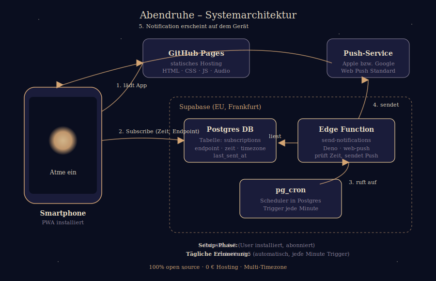

# 🌙 Abendruhe

> Eine offene Schlafmeditations-PWA gegen abendliches Doomscrolling.

**Live-Demo:** [kameliasec.github.io/abendruhe](https://kameliasec.github.io/abendruhe/)

---

## Worum geht's

Abends im Bett scrollen statt einzuschlafen ist eine Volkskrankheit. *Abendruhe* ist eine kleine, ablenkungsfreie Schlafmeditations-App, die täglich zur gewählten Uhrzeit erinnert: *"Leg das Handy weg. Atme."*

- **Auf jedem Smartphone installierbar** als Progressive Web App – kein App Store
- **Audio-Meditation** mit visueller Atem-Begleitung
- **Eine Push-Notification pro Abend**, zu einer individuell wählbaren Zeit
- **Offline-fähig** – Audio und App funktionieren ohne Internet
- **Open Source**, kein Tracking, keine Werbung

## Kontext

Universitäts-Projekt. Demo-Stand: voll funktionsfähig auf GitHub Pages, multi-user-tauglich (alle bauen mit dem gleichen Hosting). Eine spätere Produktiv-Phase auf Uni-Server ist im weiteren Studienverlauf vorgesehen.

## Wie der Nutzer die App benutzt

1. URL im Smartphone-Browser öffnen
2. "Zum Home-Bildschirm hinzufügen" (Safari) bzw. "App installieren" (Chrome)
3. App vom Homescreen starten
4. Unten "Tägliche Erinnerung" → Wunschzeit wählen → "Erinnerung aktivieren" → Notification-Erlaubnis bestätigen
5. Ab dann: täglich eine Push-Notification zur gewählten Zeit
6. Klick auf die Push öffnet direkt die Meditation

## Architektur



Fünf Komponenten:

| Komponente | Wo | Was |
|---|---|---|
| **PWA Frontend** | GitHub Pages | Vanilla HTML/CSS/JS, Audio-Player, Atem-Animation, Subscribe-UI |
| **Postgres DB** | Supabase (EU) | Eine Tabelle: pro Subscription Endpoint, Zeit, Zeitzone, last_sent_at |
| **Edge Function** | Supabase (Deno) | Liest DB, prüft pro User ob jetzt Push-Zeit ist, sendet via Web Push |
| **pg_cron** | Supabase Postgres | Scheduler, triggert die Edge Function im Minutentakt |
| **Push-Service** | Apple / Google | Web-Push-Standard-Endpoint, stellt Notification an Gerät zu |

## Tech-Stack-Entscheidungen

| Entscheidung | Alternative | Begründung |
|---|---|---|
| PWA statt native App | iOS/Android Native | Ein Code für alle Geräte, kein App-Store-Hürde, schneller iterierbar, niedrigere Einstiegshürde für Nutzer |
| Vanilla JS statt Framework | React/Vue | Übersichtlich für kleine App, kein Build-Step, gut für Lehrkontext und Code-Review |
| Supabase statt Firebase | Google Firebase | Open Source, Postgres statt proprietäre NoSQL, EU-Hosting möglich (DSGVO-freundlicher), selbst hostbar |
| pg_cron statt GitHub Actions | GitHub Actions Cron | **Wichtige Lessons-Learned:** GitHub Actions Cron im Free Tier ist "best effort" und sehr unzuverlässig (4–6 Läufe pro Tag statt 96). pg_cron läuft präzise im Minutentakt direkt in Postgres. |
| GitHub Pages | Vercel/Netlify | Echtes Open-Source-Hosting, kostenlos, Versions-Kontrolle inhärent |
| Web Push Standard | Firebase Cloud Messaging | Offener Standard, kein Vendor-Lock-in |

## Demo-Flow (für ~2 Minuten)

1. **Aufruf** der Live-URL [kameliasec.github.io/abendruhe](https://kameliasec.github.io/abendruhe/) im Safari (iPhone) oder Chrome (Android)
2. **Installation:** iOS → Teilen-Button → "Zum Home-Bildschirm" · Android → Menü → "App installieren"
3. App vom Homescreen öffnen (Mond-Icon)
4. **Meditation starten:** "Starten" tippen – Audio läuft, Atem-Animation pulsiert
5. **Erinnerung einrichten:** Runterscrollen → "Tägliche Erinnerung" → Uhrzeit auf "aktuelle Uhrzeit + 2 Minuten" stellen → "Erinnerung aktivieren" → Notifications erlauben
6. Handy weglegen, ~2 Minuten warten
7. **Push erscheint automatisch** – pg_cron in Supabase hat zur gewählten Zeit getriggert

## Datenschutz

Was die App pro Gerät speichert:

- Der Push-**Endpoint** des Browsers (technische Adresse für Apple/Google)
- Zwei **Verschlüsselungs-Keys** (`p256dh`, `auth`) für Web-Push-E2E
- Die **Wunsch-Zeit** und die **Zeitzone**
- Zeitstempel: erstellt am, zuletzt benachrichtigt am

**Wo:** Supabase-Region Frankfurt (EU). **Wie lange:** Bis "Deaktivieren" in der App getippt wird – dann werden die Daten der Subscription gelöscht. **Sonst:** Kein Tracking, keine Drittanbieter-Analytics, keine Datenweitergabe.

## Repo-Struktur

```
.
├── README.md
├── architecture.svg          ← Systemdiagramm
├── index.html                ← Frontend (Meditations-UI, Subscribe-Logik)
├── service-worker.js         ← Offline-Cache + Push-Empfänger
├── manifest.json             ← PWA-Metadaten
├── icon-192.png / icon-512.png
├── audio/
│   └── meditation.m4a        ← Geführte Audio-Meditation
├── .github/workflows/
│   └── send-notification.yml ← Alter Workflow (deaktiviert, dokumentiert die Migration)
└── scripts/                  ← Alter Notification-Sender (deaktiviert)
```

Die Notification-Logik (jetzt aktiv) läuft als **Supabase Edge Function** – Code ist nicht im Repo, sondern direkt im Supabase-Projekt deployed. Quellcode ist in der README dokumentiert oder auf Anfrage verfügbar.

## Lessons Learned

Eine kurze Reflexion auf das Projekt:

- **Cron-Reliability** ist nicht selbstverständlich, auch nicht bei großen Anbietern. GitHub-Actions-Cron im Free Tier hat die App über Tage gar nicht oder stark verzögert ausgelöst. pg_cron innerhalb der Datenbank ist deutlich zuverlässiger.
- **iOS-PWA-Push** funktioniert seit iOS 16.4 (2023), aber **nur** wenn die App zum Homescreen hinzugefügt wurde. Im Safari-Tab nicht. Das ist eine echte UX-Hürde, die in der App kommuniziert wird.
- **Row Level Security** in Supabase erfordert mit dem neuen Publishable-Key-System andere Policy-Definitionen als in der alten Doku beschrieben. Schmerzhaft entdeckt, aber sauber gelöst.
- **Web-Push als Standard** ist wertvoll: Apple und Google implementieren dasselbe Protokoll, ein VAPID-Keypair für alle Plattformen, kein Code-Unterschied zwischen iOS und Android.

## Lizenz

MIT
